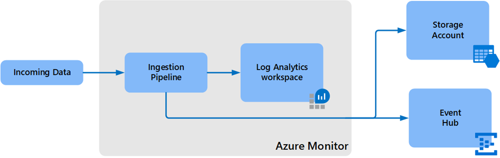
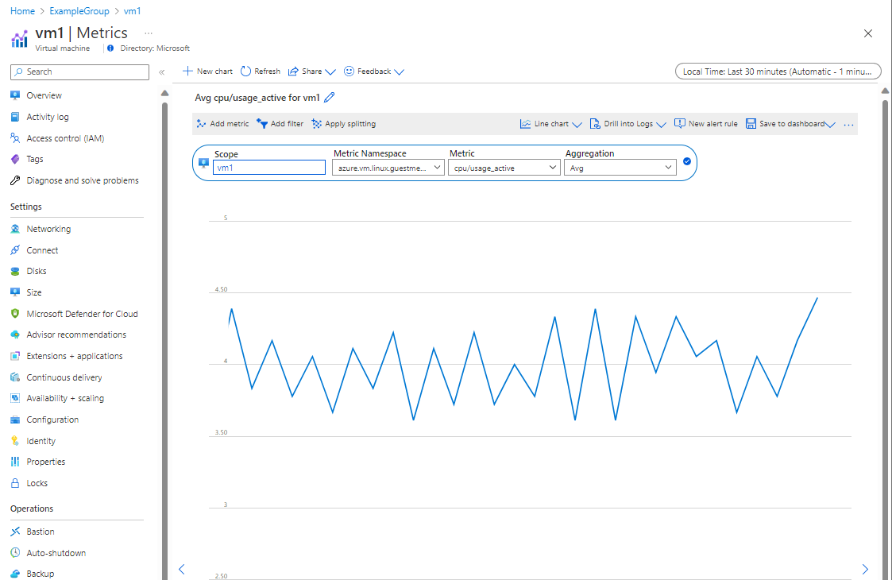
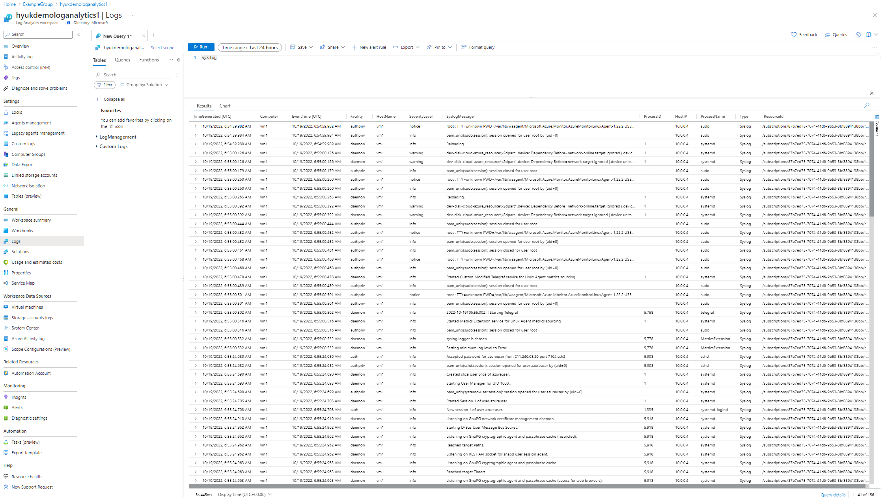
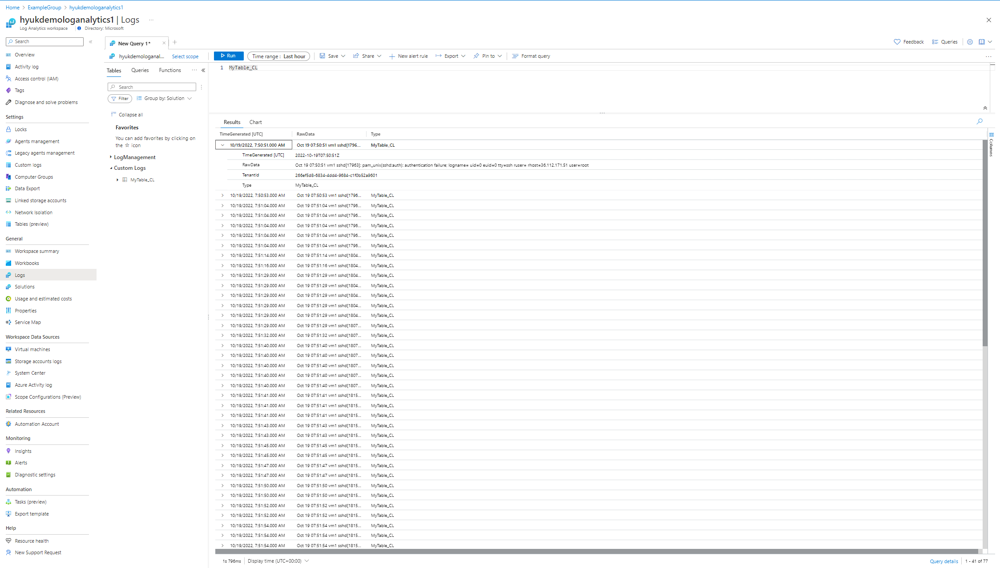

# bicep-samples

## 1. Azure Image Builder

You can customized marketplace image using Azure Image Builder which is managed service and built on HashiCorp Packet.

First you need to create an image template which describes what changes need to be done on top of the origin image. (The origin image can be an marketplace image or a custom image.) 

And then you can send 'run' command to the Image builder with the image template. Image builder service will access the source image, create a resource group, create a temporary VM along with temporary network and storage resources, perform customization on the resource group as specified in the image template and create new image from the VM and distribute the image to VM gallery as an image version.

The image template also defines distribute, output location for the created image. In this demo, azure vm gallery is used as destination.

Also an User-managed Identity shall be specified in the image template. Image builder service will use the user-managed identity to access customer environment. Before running the image template, you need to assign required permissions to access customer resources. Refer [Configure Azure VM Image Builder permissions by using the Azure CLI - Azure Virtual Machines | Microsoft Learn](https://learn.microsoft.com/en-us/azure/virtual-machines/linux/image-builder-permissions-cli) for the permissions required. 

In this demo, an User-managed Identity is created and "contributor" role is assigned to the entire subscription scope. However, in production environment, more strict permission control is needed.

In this demo, Cent OS 7.9 marketplace image is used as origin image and the following modifications are defined in the image template.

```json
customize: [
      {
        type: 'Shell'
        name: 'RunScriptFromSource'
        scriptUri: 'https://raw.githubusercontent.com/danielsollondon/azvmimagebuilder/master/quickquickstarts/customizeScript.sh'
      }
      {
          type: 'Shell'
          name: 'CheckSumCompareShellScript'
          scriptUri: 'https://raw.githubusercontent.com/danielsollondon/azvmimagebuilder/master/quickquickstarts/customizeScript2.sh'
          sha256Checksum: 'ade4c5214c3c675e92c66e2d067a870c5b81b9844b3de3cc72c49ff36425fc93'
      }
      {
          type: 'File'
          name: 'downloadBuildArtifacts'
          sourceUri: 'https://raw.githubusercontent.com/danielsollondon/azvmimagebuilder/master/quickquickstarts/exampleArtifacts/buildArtifacts/index.html'
          destination: '/tmp/index.html'
      }
      {
          type: 'Shell'
          name: 'setupBuildPath'
          inline: [
              'sudo mkdir /buildArtifacts'
              'sudo cp /tmp/index.html /buildArtifacts/index.html'
          ]
      }
    ]
```

Below are steps to run this demo.

```bash
# Create a User-managed identity
$ sigResourceGroup=ibLinuxGalleryRG
$ identityName=aibBuiUserId1665034053
$ az identity create -g $sigResourceGroup -n $identityName
{
  "clientId": "xxxxxxxx-3ba4-4965-8017-b25c046bdef3",
  "id": "/subscriptions/xxxxxxxx-xxxx-xxxx-xxxx-xxxxxxxxxxxx/resourcegroups/ibLinuxGalleryRG/providers/Microsoft.ManagedIdentity/userAssignedIdentities/aibBuiUserId1665034053",
  "location": "koreacentral",
  "name": "aibBuiUserId1665034053",
  "principalId": "xxxxxxxx-ca1a-4322-bf38-69f082ca273f",
  "resourceGroup": "ibLinuxGalleryRG",
  "tags": {},
  "tenantId": "yyyyyyyy-yyyy-yyyy-yyyy-yyyyyyyyyyyy",
  "type": "Microsoft.ManagedIdentity/userAssignedIdentities"
}

# assign role/permission/scope
imgBuilderCliId=$(az identity show -g $sigResourceGroup -n $identityName --query clientId -o tsv)
az role assignment create \
    --assignee $imgBuilderCliId \
    --role contributor \
    --scope /subscriptions/$subscriptionID

# Create resource group for image template resource
$ az group create --name exampleRG --location koreacentral

# Create an image template resource along with VM gallery and VM gallery definition.
az deployment group create --resource-group exampleRG --template-file azuredeploy.bicep --parameters azuredeploy.parameters.json

# Create an Image version using the image template created previous step.
az resource invoke-action \
     --resource-group exampleRG \
     --resource-type  Microsoft.VirtualMachineImages/imageTemplates \
     -n hyukimagebuilder  \
     --action Run
{
  "endTime": "2022-10-07T09:10:45.9514557Z",
  "name": "4CC6E7D7-5E9E-49F1-84FE-AFD8EC19AF17",
  "startTime": "2022-10-07T08:53:56.7792878Z",
  "status": "Succeeded"
}
```


## 2. Creating Image from running VM

To create VM image from running VM, use the following steps.

1. Create disk snapshots; one for OS disk and another for data disk.

2. Create managed disks from the disk snapshots

3. Create a new temporary VM from the OS disk and data disk. (Need to create VNET and NIC as well to attach the VM)

4. Deallocate and generalized the temporary VM. (Then the VM cannot be used any more)

5. Create an image from the generalized VM.

   

[2.vm_image](https://github.com/hyundonk/bicep-samples/blob/main/2.vm_image/azuredeploy.bicep) contains bicep files for above steps excep #4. (Azure CLI can be used for step 4 instead.)

Below are instructions:

```bash
# 0. Create a resource group
$ az deployment group delete -g exampleRG2 -n azuredeploy

# Run step #1, #2, and #3 using files in ./2.vm_image/
$ cd bicep-samples/2.vm_image/
$ az deployment group create --resource-group exampleRG2 --template-file azuredeploy.bicep --parameters azuredeploy.parameters.json

# Deallocate and generalized the temporary VM
$ az vm deallocate --resource-group exampleRG2 --name tmpVM
$ az vm generalize --resource-group exampleRG2 --name tmpVM

# Create an image from the generalized VM
az deployment group create --resource-group exampleRG2 --template-file image.bicep
# Alternatively, you can use Azure CLI to create an image.
$ az image create \
    --resource-group exampleRG2 \
    --source tmpVM \
    --location koreacentral \
    --name vmtargetimage \
    --hyper-v-generation V2
    
# Optionally, you can upload the created image to VM Gallery.
az sig image-version create --resource-group exampleRG \
--gallery-name hyukdemogallery --gallery-image-definition hyukdemodefinition \
--gallery-image-version 1.0.0 \
--managed-image /subscriptions/00000000-0000-0000-0000-00000000xxxx/resourceGroups/exampleRG2/providers/Microsoft.Compute/images/vmtargetimage

```

* For the demo purpose, new virtual network is created for the temporary VM and a public IP is assigned to the VM. 

  For production environment, it is recommended to use existing VNET and make VM Image builder to access the temporary virtual machine using Azure Private Link.  (https://learn.microsoft.com/en-us/azure/virtual-machines/linux/image-builder-networking#deploy-using-an-existing-vnet)


### Reference 

[Azure VM Image Builder overview - Azure Virtual Machines | Microsoft Learn](https://learn.microsoft.com/en-us/azure/virtual-machines/image-builder-overview?tabs=azure-powershell)

[Use Azure Image Builder & Azure Compute Gallery for Linux VMs - Azure Virtual Machines | Microsoft Learn](https://learn.microsoft.com/en-us/azure/virtual-machines/linux/image-builder-gallery)


## 3. Azure Monitor with Azure Monitor Agent

Azure Monitor Agent (AMA) collects performance metric data and log data from Azure VM or on-prem VM and delivers it to Azure Monitor.

Also custom log files in a VM can be collected to Azure Monitor (Log Analytics workspace) by Azure Monitor Agent. (Currently in preview)

The sample bicep file (./3.azure_monitor/azuredeploy.bicep) creates the following resources.

- Create a VNET and a Ubuntu 18.04 Virtual Machine in it. (A system-managed Identity is assigned to the VM)

- Install Azure Monitor Linux Agent on the VM

- Create a Log Analytics workspace

- Create a custom table ("MyTable_CL") in the Log Analytics workspace

- Create a Event Hub namespace and a event hub for exporting Log Analytics custom table data to event hub. (And then to the Azure Data Explorer. Azure Data Explorer integration is not included in this scope. )

- A data export rule of the custom table to the event hub

- A Data Collection Rule for

  1) Collecting performance metrics to Azure Monitor Metric Store.
  2) Collect Syslog to Azure Monitor Log Analytics

- A Data Collection Endpoint for custom log collection to the Log Analytics

- Another Data Collection Rule for

  - Collecting custom log using the data collection endpoint to the custom table in the Log Analytics workspace. In this example, '/var/log/auth.log' is collected the the custom table

  

Below is the overall diagram of conceptual data flow.

 

Data export in Log Analytics workspace lets you continuously export data per selected tables in your workspace, to an Azure Storage Account or Azure Event Hubs as it arrives to Azure Monitor pipeline. 




You can deploy the demo bicep file with the following steps.

```bash
# Clone the repository
git clone https://github.com/hyundonk/bicep-samples.git
cd bicep-samples/3.azure_monitor

# Create a resource group
az group create --name ExampleGroup --location koreacentral

# Deploy resources
az deployment group create   --name ExampleDeployment   --resource-group ExampleGroup   --template-file azuredeploy.bicep   --parameters azuredeploy.parameters.json
```


After deployment is completes, you can see the following metrics and logs.

### Guest Metrics (in azure.vm.linux.guestmetrics namespace)




### Syslog collected



### Custom log (/var/log/auth.log) collected




Ref)

[Azure Monitor Agent overview - Azure Monitor | Microsoft Learn](https://learn.microsoft.com/en-us/azure/azure-monitor/agents/agents-overview)

[Data Collection Rules in Azure Monitor - Azure Monitor | Microsoft Learn](https://learn.microsoft.com/en-us/azure/azure-monitor/essentials/data-collection-rule-overview)

[Collect text and IIS logs with Azure Monitor agent (preview) - Azure Monitor | Microsoft Learn](https://learn.microsoft.com/en-us/azure/azure-monitor/agents/data-collection-text-log)

[Log Analytics workspace data export in Azure Monitor - Azure Monitor | Microsoft Learn](https://learn.microsoft.com/en-us/azure/azure-monitor/logs/logs-data-export?tabs=portal)


